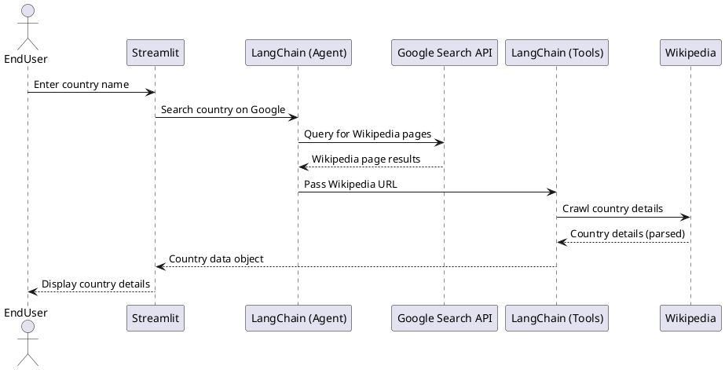

# IA Searcher

IA Searcher is an intelligent search application built using LangChain, Streamlit, ChatOllama and LangSmith. The project is designed to fetch and format specific data by integrating various tools and APIs. This project is inspired by an existing one but includes significant improvements and customizations.

---

## Inspiration

This project was inspired by the course [LangChain - Develop LLM powered applications with LangChain](https://www.udemy.com/course/langchain/) by [Eden Marco](https://x.com/EdenEmarco177).

---

## Changes from Inspiration

- Replaced **OpenAI** with **Ollama**.
- Switched from **Flask + HTML** to **Streamlit** for the frontend.
- Replaced **Tavily Search** with **Google Search API**.
- Substituted **Proxycurl/Tweepy** with a **Wikipedia Crawler**.

---

## Features

- **LangChain Integration:**
  - Agents for Google Search API queries.
  - Tools for crawling and parsing webpage data.
  - Output parsers to format responses in a specific structure.
- **Streamlit User Interface:**
  - Simple and interactive UI for end-users to perform searches and view results.
- **ChatOllama Integration:**
  - Uses the Gemma2 model for natural language processing and response generation.
- **Dependency Management:**
  - Managed with Pipenv for streamlined development.
- **Environment Management:**
  - Manages environment variables using `python-dotenv`.
- **Observability:**
  - LangSmith is used for monitoring and debugging.

---

## Setup and Installation

### Prerequisites
- Python 3.8+
- Pipenv

### Installation Steps

1. **Install Pipenv**
   ```bash
   pip3 install pipenv
   ```

2. **Create and Activate Virtual Environment**
   ```bash
   pipenv shell
   ```

3. **Install Required Libraries**

   - DotEnv Library:
     ```bash
     pipenv install python-dotenv
     ```
   - LangChain:
     ```bash
     pipenv install langchain langchain-community langchainhub
     ```
   - LangChain Ollama package:
     ```bash
     pipenv install langchain-ollama
     ```
   - LangChain Google Community:
     ```bash
     pipenv install langchain-google-community
     ```
   - Beautiful Soup:
     ```bash
     pipenv install beautifulsoup4
     ```
   - Streamlit (Frontend):
     ```bash
     pipenv install streamlit
     ```
   - Black (Code Formatter):
     ```bash
     pipenv install black
     ```

4. **Install Models for Ollama**
   ```bash
   ollama pull ollama3.2
   ollama pull mistral
   ollama pull gemma2
   ```

### Running the Application

1. Start Streamlit:
   ```bash
   streamlit run main.py
   ```

---

## Sequence Diagram



---

## Contribution Guidelines

Contributions are welcome! Please fork the repository and submit a pull request. Make sure your code is properly formatted using `black`.

---

## Support

For any questions or issues, feel free to open an issue on the repository.

---

## Acknowledgments

This project is inspired by an existing application but customized and enhanced with new tools and features for improved functionality and user experience.

---

## License
This project is licensed under the **Apache License 2.0**.
